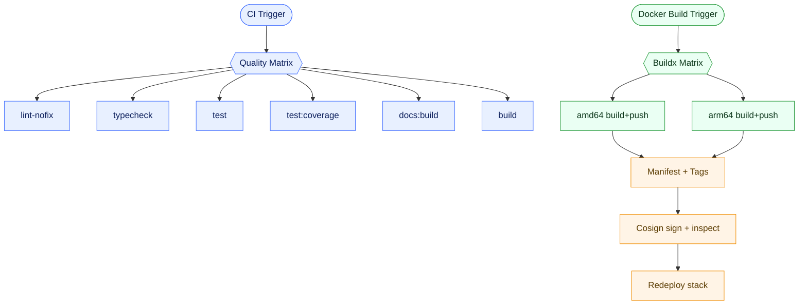

# Workflows

This folder contains GitHub Actions workflows for CI quality checks and Docker image publishing.

## `ci.yml` — CI quality matrix

**Triggers**
- `pull_request`
- `push` to `main`
- `workflow_dispatch`

**What it does**
- Checks out the repo, sets up Node 20 + pnpm, installs dependencies.
- Runs a matrix of quality steps:
  - `lint-nofix` (Biome check without writes)
  - `typecheck` (TypeScript `tsc --noEmit`)
  - `test` (Vitest run)
  - `test:coverage` (Vitest run with coverage)
  - `docs:build` (Mintlify validate; build output is not uploaded)
  - `build` (Build the application)

## `docker-build.yml` — Multi-arch Docker build + publish

**Triggers**
- `workflow_dispatch` only

**What it does**
- Reads the app version from `package.json`.
- Builds and pushes per-arch images (`linux/amd64`, `linux/arm64`) with Buildx.
- Uploads build digests as artifacts, then merges into a multi-arch manifest.
- Tags images (`sha-*`, `latest`, `vX.Y.Z`, `vX.Y`, `vX`) for GHCR and Docker Hub.
- Signs images with Cosign, inspects manifests, and redeploys the stack via SSH.

## Workflow graph

